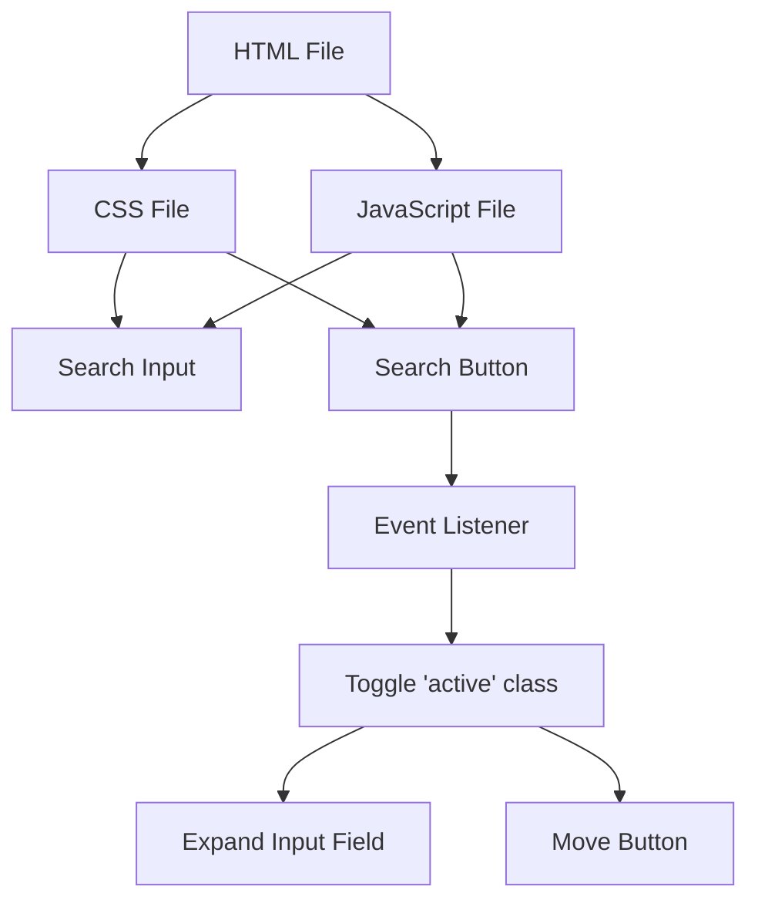

## Project Documentation: Hidden Search Widget


# 1. Hidden Search Project

## 2. Description

This code consists of a small web project that implements a hidden search bar that expands when the search button is clicked. It uses HTML, CSS, and JavaScript to create an interactive user interface.

## 3. Project Structure

### 3.1 - **HTML:** Basic structure of an HTML page.
Includes links to the CSS stylesheet and the Font Awesome icon library.
Defines a search area with an input field and a button, both inside a div with the class "search".

### 3.2 - **CSS:** Imports the Roboto font from Google Fonts.
Styles the page body with a background gradient, centering the content.
Defines styles for the search area, the input field, and the button.
Implements a smooth transition for the input field width and the button position when the "active" class is added.

### 3.3 - **JavaScript:** Selects the necessary DOM elements: the search area, the button, and the input field.
Adds a click event to the button that:
Toggles the "active" class on the search area, activating the CSS transitions.
Automatically focuses on the input field for easy typing.

### 3.4 - **Overall Project Functionality:** Initial interface: The search area appears with a small input field and a magnifying glass icon (button).
User interaction: When the search button is clicked, the search area expands.
Styling and transition: The input field expands from 50px to 200px, and the button moves to the right, creating a smooth visual effect.
Auto-focus: The input field automatically receives focus, allowing the user to start typing immediately.
This code combines HTML, CSS, and JavaScript to create a pleasant and interactive user experience for an expandable search bar.

## 4. UML Diagrams

### 4.1 Component Diagram


### 4.2 SequenceDiagram

```
sequenceDiagram
    participant User
    participant Browser
    participant HTML
    participant CSS
    participant JavaScript

    User->>Browser: Load Page
    Browser->>HTML: Fetch HTML
    HTML->>CSS: Apply CSS
    HTML->>JavaScript: Execute JavaScript
    User->>Button: Click
    JavaScript->>CSS: Toggle 'active' class
    CSS->>Input: Expand Width
    CSS->>Button: Move Button
    JavaScript->>Input: Focus Input

```

   

